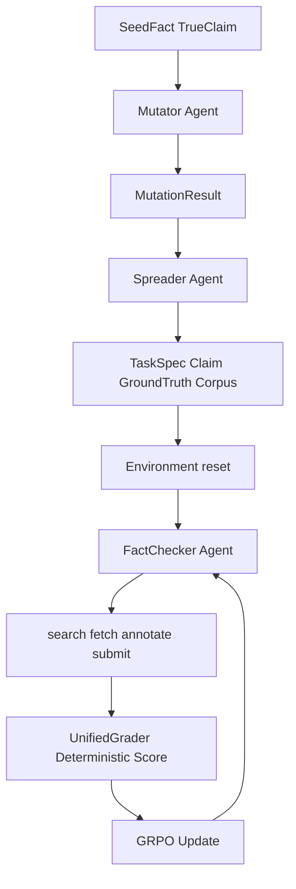
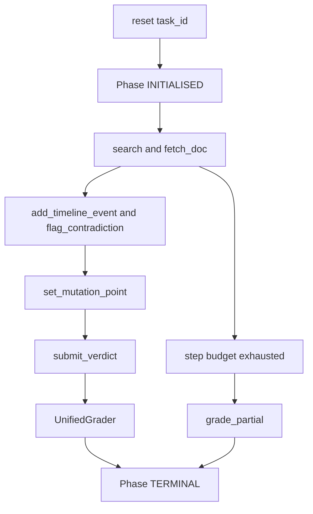
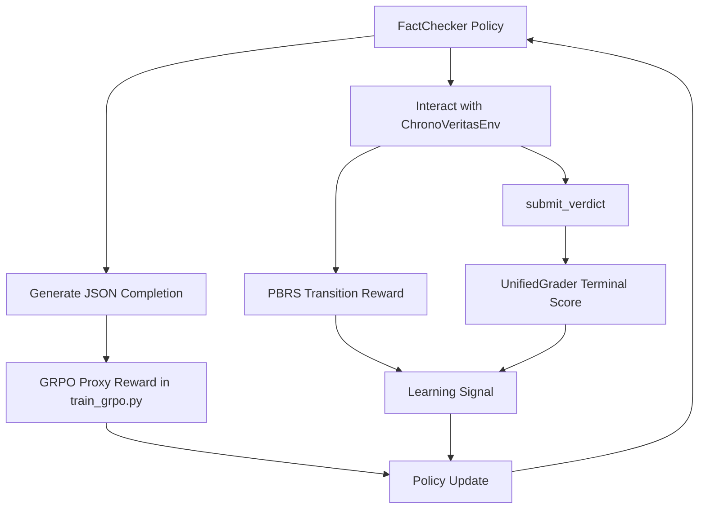

# ChronoVeritas — Information Provenance & Verification Environment

<p align="center">
  <strong>Can an AI model map the anatomy of a falsehood?</strong><br>
  <em>Training RL agents to reverse-engineer misinformation — faster, cheaper, and more reliably than human intelligence.</em>
</p>

An [OpenEnv](https://meta-pytorch.org/OpenEnv/index.html)-compliant reinforcement learning environment for **temporal fact-checking**. Agents investigate how a factual claim mutates as it propagates through a document corpus — from authoritative primary sources through news reports to informal media — and must identify *where* the truth was distorted, *how* it was altered, and *why* the mutation matters.

## Motivation

Every major platform — Meta, X/Twitter, YouTube, Reuters — employs teams of humans to verify claims that spread online. They don't just need to know if something is true *today*. They need to know **when it became false, who distorted it, and where it originated.** This is a task with hundreds of millions of dollars of real-world labor behind it and **no scalable automated solution today.**

### The Problem at Scale

| Who | What They Do Today | Cost / Speed |
|---|---|---|
| **Meta / X / YouTube** | Human moderators flag viral posts that are distorted versions of real stories before they spread | **$200M+/year** in content moderation spend |
| **Reuters / AP / Bloomberg** | Journalists cross-reference breaking claims against archived sources before publishing | **30–90 minutes** manually per story |
| **SEC / Financial compliance** | Teams detect when an executive's current statement contradicts a prior filing — a legal requirement | **Hundreds of analysts**, mandatory under law |

Existing AI approaches fall short. X's Grok chatbot has a documented history of hallucinating facts and generating incorrect information — it can *produce* misinformation faster than it can detect it. Reuters and AP have no RL-based solution for claim verification. Every major platform still relies on human reviewers cross-referencing claims against reputable sources and trusted databases, one story at a time.

**ChronoVeritas** is the first RL environment that models this exact workflow: given a claim and a corpus of timestamped documents with varying reliability, the agent must classify the truth status, identify the mutation type, and locate the exact source where the distortion originated.

Misinformation rarely appears from nothing. It evolves: a government report states a 5% budget increase; a news article rounds it to "nearly 10%"; a blog post claims "budgets doubled." ChronoVeritas models this real-world mutation process and challenges AI agents to:

1. **Search** a corpus of documents with varying reliability tiers
2. **Reconstruct** the chronological timeline of how a claim evolved
3. **Identify** the exact document where the mutation occurred
4. **Classify** the mutation type (distortion, omission, fabrication, context shift)
5. **Deliver** a verdict with calibrated confidence

Unlike simple binary fact-checking benchmarks, ChronoVeritas requires agents to perform **multi-hop reasoning across conflicting sources** — the core skill needed for real-world misinformation forensics.

### Why Reinforcement Learning?

This problem has **genuine non-linear structure** that makes it ideal for RL:

- An agent that masters verdict accuracy still scores poorly if it can't localize the mutation point.
- An agent that retrieves exhaustively still gets penalized on efficiency.
- The agent must decide **when to re-search** (backtracking is expensive), **which contradictions are meaningful** vs. noise, and **how far back to trace** a claim's origin.
- Every decision has a **cost-vs-reward tradeoff** — exactly what RL is built to optimize.

This is exactly the kind of environment that differentiates **RL-trained agents from prompt-engineered ones** — the multi-dimensional reward surface cannot be solved by a single chain-of-thought prompt.

---

## Round 2 Upgrade (What Changed)

Round 2 upgrades ChronoVeritas from a single static benchmark into a **full training system** with:

- `Mutator` agent that programmatically injects claim mutations.
- `Spreader` agent that embeds those mutations into realistic multi-tier corpora.
- `Fact-Checker` agent trained with GRPO to investigate, localize, and verify provenance.
- deterministic environment grading + online shaping signal designed to resist reward hacking.

This directly aligns with hackathon expectations around **innovation**, **clear storytelling**, **observable reward improvement**, and a **reproducible training pipeline**.

---

## Multi-Agent Interaction (Round 2)

### 🧬 Agent Roles

| Agent | File | Responsibility |
|---|---|---|
| `Mutator` | `agents/mutator.py` | Applies deterministic mutation operators (`distortion`, `fabrication`, `omission`, `context_shift`) |
| `Spreader` | `agents/spreader.py` | Builds task corpora with reliability tiers, propagation chains, and noise docs |
| `Fact-Checker` | `train_grpo.py` + env API | Investigates documents and outputs JSON verdict/provenance decisions |

### 🔄 Round 2 Generation + Solving Flow



---

## Environment Interaction Design

### 👀 Observation Space

At each step, the agent receives:

- `claim`
- `corpus_metadata` (discovered via `search`)
- `retrieved_docs` (full fetched text)
- `agent_timeline`
- `flagged_contradictions`
- `current_step` / `max_steps`
- `token_budget_remaining`
- `partial_reward_so_far`

**Critical anti-leak design:** episode starts with empty visible corpus metadata, so the agent must explore first.

### 🎮 Action Space

| Action | Step Cost | Token Cost | Notes |
|---|---|---|---|
| `search` | 1 | 0 | BM25 retrieval of document metadata |
| `fetch_doc` | 1 | estimated doc tokens | supports truncation if remaining token budget is low |
| `add_timeline_event` | 0 | 0 | free annotation |
| `flag_contradiction` | 0 | 0 | free contradiction marking |
| `set_mutation_point` | 0 | 0 | records hypothesis, no GT reward leak |
| `submit_verdict` | terminal | 0 | triggers deterministic grading |

### 🧭 Episode Lifecycle



---

## Reward Function Interaction with Agent

### 🛡️ Core Principle: No Answer Leakage

`set_mutation_point` never compares against ground truth at action time and always returns reward `0.0`.  
Ground-truth matching occurs only during terminal grading.

### ⚙️ Online Environment Reward (During Episode)

`env/environment.py` adds **Potential-Based Reward Shaping (PBRS)** on non-terminal transitions:

- `phi(s)` tracks investigation progress from observable evidence only.
- shaping term: `0.15 * (phi_after - phi_before)`.
- sub-potentials include exploration coverage, source authority, contradiction density, hypothesis grounding, and evidence coherence.

This gives learning signal for process quality without exposing final answers.

### 🧪 Terminal Deterministic Grading (At Submit)

`graders/unified_grader.py` computes weighted components:

- verdict accuracy
- mutation type
- mutation point localization
- provenance F1
- source reliability
- timeline quality
- efficiency
- early detection
- reconciliation
- penalties: hallucination + Brier calibration

All math is deterministic; no LLM-as-judge randomness.

### 🧠 Training-Time Proxy Reward (GRPO)

`train_grpo.py` uses a proxy reward aligned with grader-available fields from generated completions:

- format validity
- verdict
- mutation type
- mutation point
- provenance
- source reliability
- penalties for hallucination and miscalibration

This avoids train/eval objective mismatch and makes reward curves meaningful.

### 🔁 Reward-Agent Coupling Diagram



---

## Tasks and Difficulty Progression

Round 2 supports both:

- seeded benchmark tasks in `data/tasks/*.json`
- large generated curriculum in `data/tasks/generated/*.json` from Mutator + Spreader

Generated task scaling in `agents/spreader.py`:

| Difficulty | Typical Corpus Size | Noise Docs | Default Max Steps |
|---|---|---|---|
| `easy` | 3 | 0 | 20 |
| `medium` | 6 | 2 | 25 |
| `hard` | 12 | 4 | 35 |

Training script supports curriculum (`easy -> easy+medium -> all`) via `train_grpo.py`.

---

## Project Structure (Round 2)

```text
chronoveritas/
├── agents/
│   ├── mutator.py
│   ├── spreader.py
│   └── task_bank.py
├── env/
│   ├── environment.py
│   ├── actions.py
│   ├── models.py
│   └── state_manager.py
├── graders/
│   ├── base_grader.py
│   └── unified_grader.py
├── server/
│   └── app.py
├── training/
│   ├── reward_fn.py
│   └── sft_warmup.py
├── train_grpo.py
├── eval.py
├── generate_data.py
└── openenv.yaml
```

---

## Quick Start (Round 2)

### 1) Generate tasks

```bash
python generate_data.py --easy 10 --medium 10 --hard 5
```

### 2) Optional SFT warmup

```bash
python training/sft_warmup.py --n-examples 200 --output ./chronoveritas-sft
```

### 3) Train with GRPO

```bash
python train_grpo.py --difficulty curriculum --steps 400
```

### 4) Evaluate and create plots

```bash
python eval.py --model ./chronoveritas-fact-checker --baseline
```

Expected artifacts:

- `training_logs/reward_log.json`
- `plots/reward_curve.png`
- `plots/component_breakdown.png`
- `plots/before_after.png`
- `eval_results.json`

---

## API Reference (v2)

### Core OpenEnv endpoints

| Method | Path | Purpose |
|---|---|---|
| `GET` | `/health` | liveness check |
| `GET` | `/tasks` | list available tasks |
| `POST` | `/reset` | start episode |
| `POST` | `/step` | execute action |
| `GET` | `/state` | current observation |

### Round 2 multi-agent demo endpoints

| Method | Path | Purpose |
|---|---|---|
| `POST` | `/mutate` | run Mutator on a selected/random seed fact |
| `POST` | `/spread` | build full task corpus from mutation |
| `GET` | `/demo` | one-shot end-to-end story (mutate -> spread -> solve target) |
| `GET` | `/seed-facts` | inspect available seed facts |

---

## Why This Scores Well in Hackathon Round 2

### 💡 Environment Innovation (40%)

- realistic misinformation lifecycle modeling, not static QA.
- explicit adversarial generation through Mutator + Spreader.
- mixed reliability tiers, propagation dynamics, and noise injection.

### 🎬 Storytelling & Presentation (30%)

- clear three-agent narrative with deterministic mechanics.
- flowcharts that map directly to implementation files.
- easy-to-follow investigation loop from claim to provenance verdict.

### 📈 Showing Reward Improvement (20%)

- training/eval pipeline outputs reproducible reward logs and visual curves.
- before/after comparisons supported in `eval.py`.
- component-level breakdown demonstrates what exactly improved.

### 🧱 Reward + Training Pipeline (10%)

- coherent reward stack across online shaping, terminal grader, and GRPO proxy.
- anti-hacking design: no reward leakage at mutation declaration, hallucination penalties, confidence calibration penalties.
- deterministic grader ensures reproducible evaluation under fixed trajectories.

---

## License

MIT
