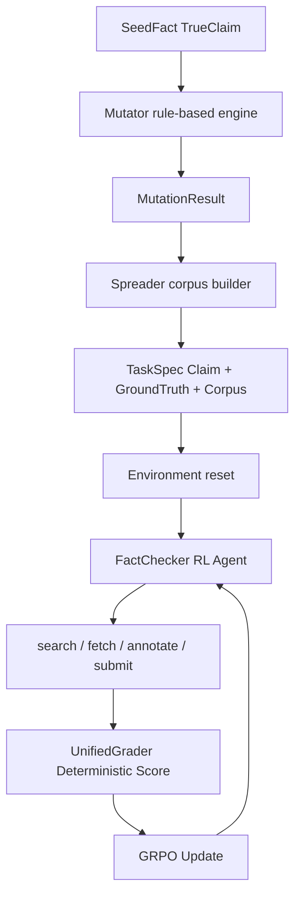
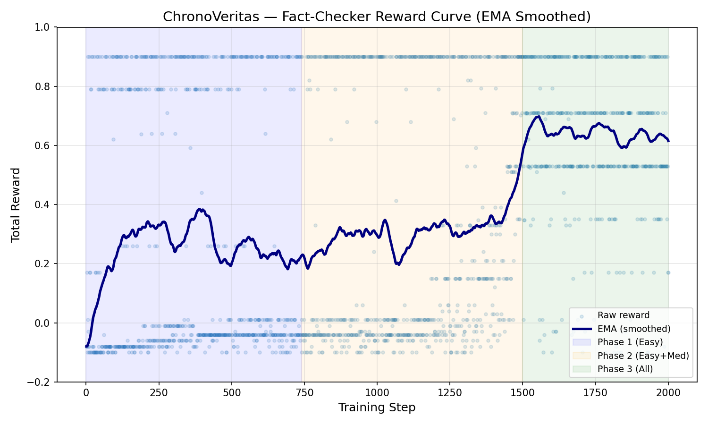
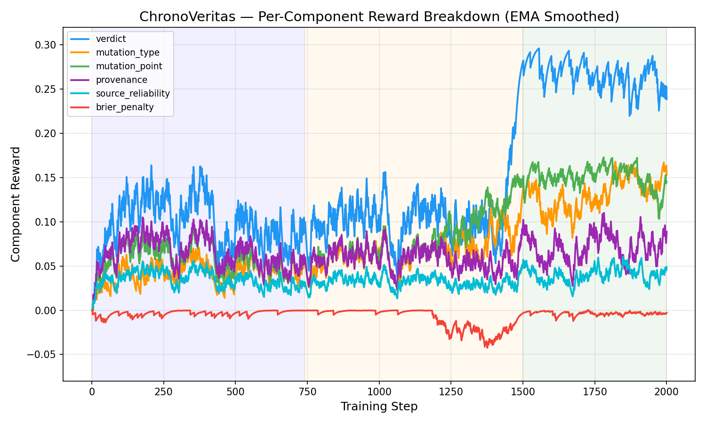
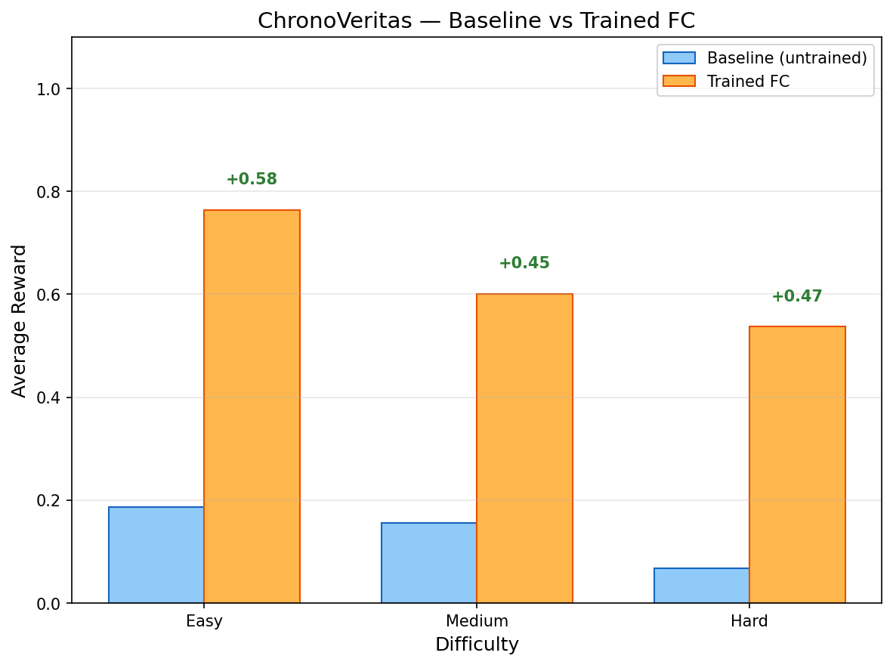

# ChronoVeritas — Information Provenance & Verification Environment

<p align="center">
  <strong>Can an AI model map the anatomy of a falsehood?</strong><br>
  <em>Training RL agents to reverse-engineer misinformation — faster, cheaper, and more reliably than human fact-checkers.</em>
</p>

<p align="center">
  <a href="Blog.md">📝 Blog</a> &nbsp;|&nbsp;
  <a href="RUN_README.md">⚙️ Setup Guide</a> &nbsp;|&nbsp;
  <a href="reward_design.md">🧮 Reward Design</a>
</p>

---

An [OpenEnv](https://meta-pytorch.org/OpenEnv/index.html)-compliant reinforcement learning environment for **temporal fact-checking**. Agents investigate how a factual claim mutates as it propagates through a document corpus — from authoritative primary sources through news reports to informal media — and must identify *where* the truth was distorted, *how* it was altered, and *why* the mutation matters.

---

## Why This Problem Matters

Every major platform — Meta, X/Twitter, YouTube, Reuters — employs teams of humans to verify claims that spread online. They don't just need to know if something is true *today*. They need to know **when it became false, who distorted it, and where it originated.** This is a task with hundreds of millions of dollars of real-world labor behind it and no scalable automated solution today.

| Who | What They Do Today | Cost / Speed |
|---|---|---|
| **Meta / X / YouTube** | Human moderators flag viral posts that are distorted versions of real stories | **$200M+/year** in content moderation spend |
| **Reuters / AP / Bloomberg** | Journalists cross-reference breaking claims against archived sources before publishing | **30–90 minutes** manually per story |
| **SEC / Financial compliance** | Teams detect when an executive's current statement contradicts a prior filing — a legal requirement | **Hundreds of analysts**, mandatory under law |

Existing AI approaches fall short. Chatbots can *produce* misinformation faster than they can detect it. There is no RL-based solution for automated claim verification at any major news organization. Every major platform still relies on human reviewers cross-referencing claims against reputable sources, one story at a time.

**ChronoVeritas** models this exact workflow as an RL environment: given a claim and a corpus of timestamped documents with varying reliability tiers, an agent must classify the truth status, identify the mutation type, and locate the exact source where distortion was introduced.

---

## The Pitch

Misinformation rarely appears from nothing — it *evolves*:

> A government report states a **5% budget increase** → a news article rounds it to **"nearly 10%"** → a blog post claims **"budgets doubled."**

ChronoVeritas models this real-world mutation lifecycle and trains AI agents to reverse-engineer it:

1. **Search** a corpus of documents with varying reliability tiers
2. **Reconstruct** the chronological timeline of how a claim evolved
3. **Identify** the exact document where the mutation occurred
4. **Classify** the mutation type (distortion, omission, fabrication, context shift)
5. **Deliver** a verdict with calibrated confidence

Unlike simple binary fact-checking benchmarks, ChronoVeritas requires **multi-hop reasoning across conflicting sources** — the core skill needed for real-world misinformation forensics.

### Why Reinforcement Learning?

This problem has **genuine non-linear structure** that makes it ideal for RL:

- An agent that masters verdict accuracy still scores poorly if it can't localize the mutation point.
- An agent that retrieves exhaustively still gets penalized on efficiency.
- The agent must decide **when to re-search** (backtracking costs steps), **which contradictions are meaningful** vs. noise, and **how far back to trace** a claim's origin.
- Every decision involves a **cost-vs-reward tradeoff** — exactly what RL is built to optimize.

This is the kind of environment that differentiates **RL-trained agents from prompt-engineered ones** — the multi-dimensional reward surface cannot be solved by a single chain-of-thought prompt.

---

## How The Environment Works

### System Overview

ChronoVeritas is a **single-agent RL system** with a programmatic data generation pipeline:

- `Mutator` — a deterministic rule-based engine that injects claim mutations into seed facts.
- `Spreader` — a corpus builder that embeds those mutations into realistic multi-tier document sets.
- `Fact-Checker` — the **RL agent**, trained with GRPO to investigate, localize, and verify provenance.
- Deterministic environment grading + online potential-based reward shaping.



### Document Reliability Tiers

Every document in the corpus carries a reliability tier visible at search time:

| Tier | Label | Examples | Trust Weight |
|---|---|---|---|
| 1 | Official | Government filings, court records, peer-reviewed research | 1.0 |
| 2 | Institutional | Major news organizations, corporate press releases | 0.5 |
| 3 | Informal | Blogs, forums, social media, leaked documents | 0.1 |

The Fact-Checker must learn to **anchor its reasoning in Tier-1 sources** — rewarded through the `source_reliability` scoring component.

### Action Space

| Action | Step Cost | Token Cost | Notes |
|---|---|---|---|
| `search` | 1 | 0 | BM25 retrieval of document metadata |
| `fetch_doc` | 1 | estimated doc tokens | Full document text; supports truncation if budget is low |
| `add_timeline_event` | 0 | 0 | Free annotation — no answer leakage |
| `flag_contradiction` | 0 | 0 | Free contradiction marking |
| `set_mutation_point` | 0 | 0 | Records hypothesis; **always returns reward 0.0 — no GT leak** |
| `submit_verdict` | terminal | 0 | Triggers deterministic grading |

### Anti-Exploit Design

- **No answer leakage:** `set_mutation_point` never touches ground truth. Reward is always 0.0 at declaration time.
- **Evidence grounding:** Process bonuses check only whether the agent *read the evidence* — not whether the evidence is *correct*.
- **Hallucination detection:** Citing document IDs the agent never fetched triggers a penalty.
- **Brier calibration penalty:** Overconfident wrong answers and underconfident correct answers are both penalized.

---

## Reward Design

### Three-Layer Reward Stack

```
Layer 1 — Online (during episode):
  Potential-based reward shaping (PBRS) in env/environment.py
  Φ(s) = f(exploration, authority, contradictions, hypothesis grounding, coherence)
  Shaped step reward = 0.15 × (Φ_after − Φ_before)

Layer 2 — Terminal (at submit_verdict):
  UnifiedGrader — fully deterministic, no LLM-as-judge
  Scores: verdict, mutation type, mutation point, provenance F1,
          source reliability, timeline Kendall τ, efficiency,
          early detection, reconciliation, hallucination penalty, Brier penalty

Layer 3 — Training proxy (GRPO only):
  compute_reward() in train_grpo.py
  Text-only scoring that mirrors grader components available without EpisodeState
```

### GRPO Proxy Reward Weights

| Component | Weight | Description |
|---|:---:|---|
| Format | +0.05 | Valid JSON with all required fields |
| Verdict | +0.30 | Correct verdict (true / false / misleading / unverifiable) |
| Mutation Type | +0.18 | Correct mutation class |
| Mutation Point | +0.18 | Correct source document (0.5× for adjacent in timeline) |
| Provenance F1 | +0.18 | Multiset F1 between predicted and ground-truth chain |
| Source Reliability | +0.11 | Avg reliability tier of cited documents |
| Hallucination Penalty | −0.12 | Per fabricated doc ID in provenance chain |
| Brier Penalty | −0.08 | Miscalibrated confidence (×1.5 if overconfident + wrong) |

---

## Results

Training was run for **2,000 steps** on a single RTX A4500 (20GB VRAM) using Qwen2.5-7B-Instruct with 4-bit QLoRA via Unsloth + TRL GRPOTrainer.

### Key Numbers

| Metric | Before Training (first 25%) | After Training (last 25%) | Δ |
|---|:---:|:---:|:---:|
| **Mean total reward** | 0.299 | 0.665 | **+0.367** |
| **Parse error rate** | 10% | 0% | **−10pp** |
| **Steps with reward ≥ 0.95** | — | — | **28.1% of all steps** |
| **Avg verdict reward** | 0.087 | 0.263 | **+0.176** |

### Reward Curve (EMA smoothed, α = 0.05)



*Three curriculum phases visible: Phase 1 (easy tasks only) establishes baseline JSON formatting and verdict accuracy. Phase 2 (easy + medium) forces mutation type discrimination. Phase 3 (all difficulties) drives provenance chain reasoning.*

### Component-Level Breakdown



*Each component trained at different rates. Verdict and mutation point converged earliest; provenance chain reasoning showed sustained improvement through Phase 3.*

### Before vs. After



---

## Data Generation

Training uses both seeded benchmark tasks (`data/tasks/*.json`) and a generated curriculum (`data/tasks/generated/`) from the Mutator + Spreader pipeline. Tasks scale with difficulty:

| Difficulty | Corpus Size | Noise Docs | Max Steps |
|---|---|---|---|
| `easy` | ~3 docs | 0 | 20 |
| `medium` | ~6 docs | 2 | 25 |
| `hard` | ~12 docs | 4 | 35 |

Training uses a three-phase curriculum: easy → easy+medium → all difficulties.

---

## Project Structure

```text
Meta_OpenEnv/
├── agents/
│   ├── mutator.py          # Deterministic mutation engine (4 mutation types)
│   ├── spreader.py         # Corpus builder (multi-tier docs + noise + provenance)
│   └── task_bank.py        # Seed facts — ground-truth claims across 8 domains
├── env/
│   ├── environment.py      # Episode lifecycle + PBRS reward shaping
│   ├── actions.py          # Action handlers (search, fetch, annotate, grade)
│   ├── models.py           # Pydantic v2 typed models
│   └── state_manager.py    # Mutable episode state with phase transitions
├── graders/
│   ├── base_grader.py
│   ├── easy_grader.py
│   ├── medium_grader.py
│   ├── hard_grader.py
│   └── unified_grader.py   # Single entry point used by env + eval
├── server/
│   └── app.py              # FastAPI server (OpenEnv HTTP API)
├── training/
│   └── sft_warmup.py       # SFT warm-up before GRPO
├── train_grpo.py           # Main GRPO training script
├── eval.py                 # Evaluation + plotting
├── generate_data.py        # CLI for bulk task generation
├── reward_design.md        # Reward function documentation
├── RUN_README.md           # Detailed environment setup guide
├── requirements_train.txt  # Frozen deps — chronoveritas-train conda env
├── requirements_infer.txt  # Frozen deps — chronoveritas-infer conda env
├── Dockerfile              # Container for inference server (HF Spaces)
└── openenv.yaml            # OpenEnv specification manifest
```

---

## Quick Start

> **Full setup instructions including conda environment creation:** see [`RUN_README.md`](RUN_README.md).

Two conda environments are required:
- `chronoveritas-train` — data generation, SFT, GRPO training, evaluation
- `chronoveritas-infer` — vLLM-based inference server

```bash
# 1. Create environments
conda create -n chronoveritas-train python=3.10 -y
conda activate chronoveritas-train
pip install --extra-index-url https://download.pytorch.org/whl/cu121 \
    -r Meta_OpenEnv/requirements_train.txt

# 2. Generate training tasks
conda activate chronoveritas-train
python generate_data.py --easy 50 --medium 20 --hard 10

# 3. Optional SFT warm-up (train JSON format compliance first)
python training/sft_warmup.py --n-examples 200 --output ./chronoveritas-sft

# 4. GRPO training (full curriculum, ~3–4h on RTX A4500)
python train_grpo.py --difficulty curriculum --steps 400

# 5. Evaluate and generate plots
python eval.py --model ./chronoveritas-fact-checker --baseline
```

Expected output artifacts:
- `training_logs/reward_log.json` — per-step reward breakdown
- `plots/ema/reward_curve.png`
- `plots/ema/component_breakdown.png`
- `plots/ema/before_after.png`
- `eval_results.json`

---

## API Reference

### Core OpenEnv endpoints

| Method | Path | Purpose |
|---|---|---|
| `GET` | `/health` | Liveness check |
| `GET` | `/tasks` | List available tasks |
| `POST` | `/reset` | Start episode |
| `POST` | `/step` | Execute action |
| `GET` | `/state` | Current observation |

### Data generation demo endpoints

| Method | Path | Purpose |
|---|---|---|
| `POST` | `/mutate` | Run Mutator on a selected/random seed fact |
| `POST` | `/spread` | Build full task corpus from a mutation |
| `GET` | `/demo` | One-shot end-to-end demo (mutate → spread → env episode) |
| `GET` | `/seed-facts` | Inspect available seed facts |

---

## License

MIT
